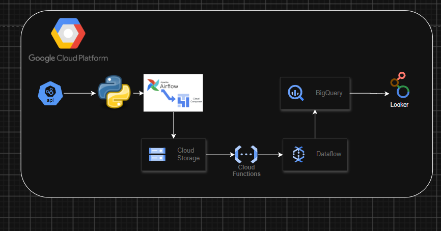
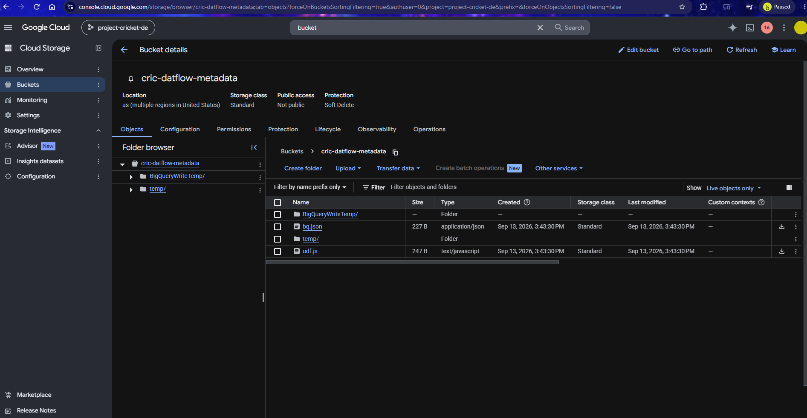
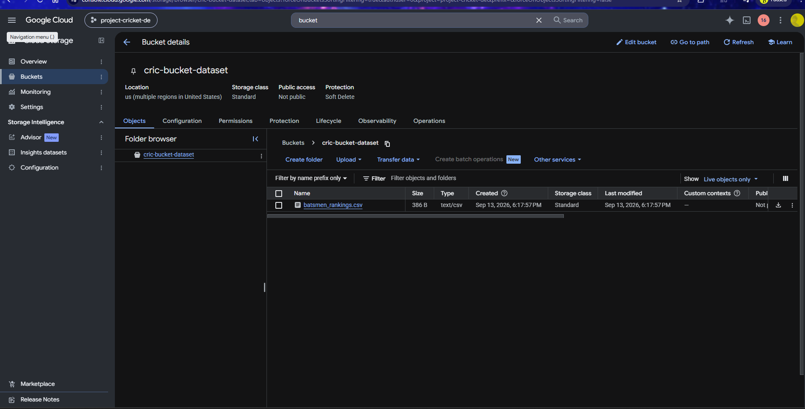
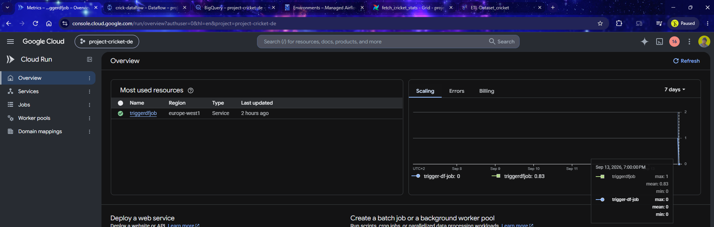
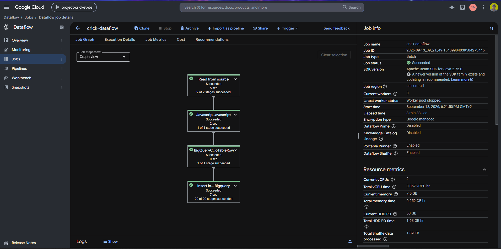
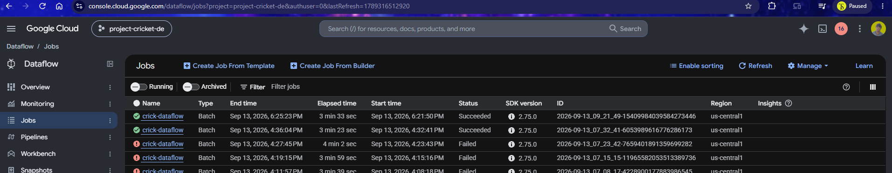
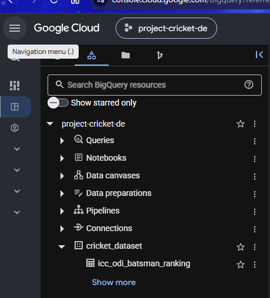
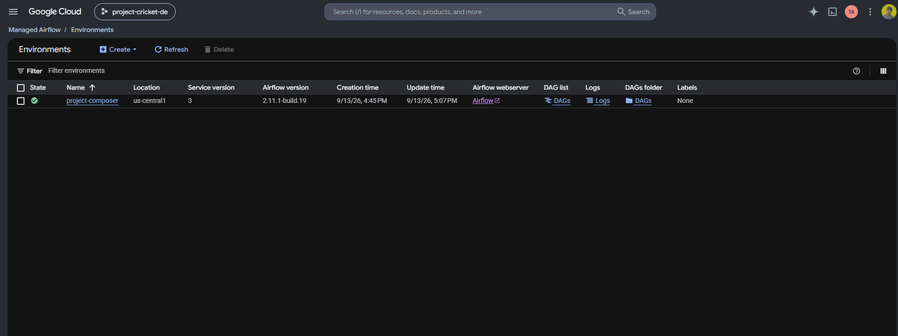
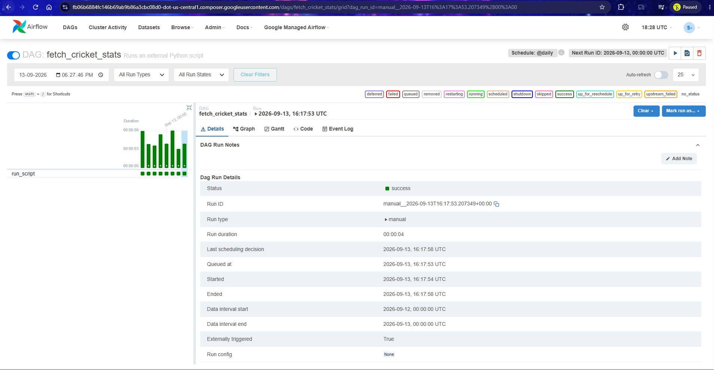
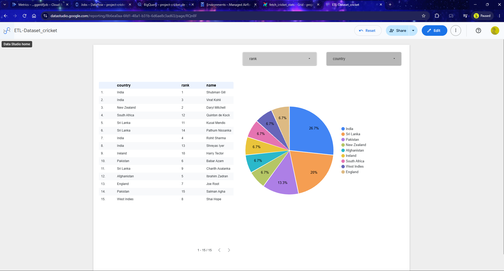

# Building Data Pipeline with Google Cloud Platform,Airflow-> Looker

## ETL Pipeline Process:-
Data Source-> Cloud Composer (Airflow) -> Storage-> Function->  ETL-Filtering,Phrasing,Validation(Dataflow) -> BigQuery -> Visualize(Looker)

### Architecture

### Step's

### Data Retrieval with Python and Cricbuzz API
The foundation of our project begins with Python’s prowess in interfacing with APIs. We’ll delve into the methods of fetching cricket statistics from the Cricbuzz API, harnessing the power of Python to gather the required data efficiently.

The Cricbuzz API is available through [RapidAPI](https://rapidapi.com/cricketapilive/api/cricbuzz-cricket).

Extractor code: [extract_data.py](extract_data.py)

### Storing Data
Once the data is obtained, our next step involves preserving it securely in the cloud. We’ll explore how to store this data in a CSV format within Google Cloud Storage (GCS), ensuring accessibility and scalability for future processing.

### Creating a Cloud Function Trigger
With our data safely stored, we proceed to set up a Cloud Function that acts as the catalyst for our pipeline. This function triggers upon file upload to the GCS bucket, serving as the initiator for our subsequent data processing steps.

Automate trigger via ariflow - GCP Function : [trigger_df_job.py](trigger_df_job.py)

### Execution of the Cloud Function
Within the Cloud Function, intricate code is crafted to precisely trigger a Dataflow job. We’ll meticulously handle triggers and pass the requisite parameters to seamlessly initiate the Dataflow job, ensuring a smooth flow of data processing.

### Dataflow for BigQuery
The core of our pipeline lies in the Dataflow job. Triggered by the Cloud Function, this job orchestrates the transfer of data from the CSV file in GCS to BigQuery. We’ll meticulously configure the job settings to ensure optimal performance and accurate data ingestion into BigQuery.Following from automate trigger of Airflow

### Looker Dashboard Creation
Finally, we’ll explore the potential of BigQuery as a data source for Looker Studio. Configuring Looker to connect with BigQuery, we’ll create a visually compelling dashboard. This dashboard will serve as the visualization hub, enabling insightful analysis based on the data loaded from our cricket statistics pipeline.

